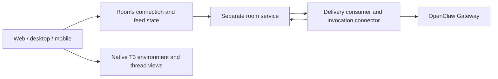

# Rooms architecture and migration

Source review: 2026-09-29, client `main` `ca74c303b`. Proposed boundaries below are
targets, not implemented features. Product scope lives in the
[Rooms direction](../rooms/README.md); issue status lives in
[#26](https://github.com/benwilliams0540/t3code/issues/26).

## How it works today

The room service owns shared membership and room history. The connector consumes
deliveries, records invocation progress, runs an adapter and returns an
attributed result. Native T3 thread views use T3 environment/project/thread
identity. These are distinct execution paths; an OpenClaw invocation is not
automatically a native T3 thread.

The OpenClaw adapter currently makes a session key from **each invocation ID**:
`agent:${agentId}:rooms-${invocation.invocationId}`. A follow-up mention therefore
gets a different session, even in the same channel. Bounded channel context can
make a reply look continuous without providing a durable work session. Changing
that string alone would leave persistence, ordering, permissions and navigation
undefined.

### Current code map and ownership gaps

Paths below are repository-relative and exist at the review revision.

| Area                      | Entry point                                                                                                    | Current responsibility / needed boundary                                                                                                                                                 |
| ------------------------- | -------------------------------------------------------------------------------------------------------------- | ---------------------------------------------------------------------------------------------------------------------------------------------------------------------------------------- |
| Room UI                   | `apps/web/src/features/rooms/shell/`, `channel/`, `threads/`                                                   | Presentation and selection. Feed loading and lifecycle decisions still leak into components.                                                                                             |
| Web connection state      | `apps/web/src/features/rooms/dataSource/RoomsDataSourceProvider.tsx`                                           | Over 1,000 lines combine auth generations, source/profile selection, refresh/change loops, messages, stories and invites. Extract owned state, then delete its duplicate decisions here. |
| Channel feed              | `apps/web/src/features/rooms/channel/RoomsLocalChannelFeed.tsx`                                                | Fetch/refresh/pagination lives with rendering. A first-page refresh can miss new messages in long channels.                                                                              |
| Mobile connection state   | `apps/mobile/src/features/rooms/RoomsRealtimeCoordinator.tsx`                                                  | Separate client/loop lifecycle. Share protocol and state ownership while keeping native UI/platform storage adapters.                                                                    |
| Shared client state       | `packages/client-runtime/src/rooms/`                                                                           | Presently contains agent-turn/story helpers; the natural home for reusable connection and conversation state.                                                                            |
| Wire clients              | `apps/web/src/features/rooms/dataSource/humanSharedClient.ts`, `humanSharedContract.ts`, `localChangesLoop.ts` | Shared decoding must preserve validated cursor-head errors; transport/decoding belongs behind shared interfaces.                                                                         |
| Project/thread navigation | `apps/web/src/features/rooms/threads/roomProjectBindings.ts`, `RoomsNativeThreadSurface.tsx`                   | Browser-local bindings and native T3 rendering. Navigation is not a source-enforced sharing grant or an OpenClaw session viewer.                                                         |
| Agent execution           | `packages/rooms-agent-connector/src/connector.ts`, `contracts.ts`                                              | Delivery/invocation lifecycle, leases, correlation and duplicate suppression. Preserve these while separating conversation binding from turn identity.                                   |
| OpenClaw adapter          | `packages/rooms-agent-connector/src/openClawGatewayTransport.ts`                                               | Gateway-specific protocol, waiting and history. Current per-invocation session and restricted request options need an explicit continuing-work contract.                                 |
| Connector process         | `packages/rooms-agent-connector-host/src/config.ts`, `host.ts`                                                 | Supervision/configuration. Currently requires native T3 environment/project/thread IDs even with OpenClaw; target configuration must express the actual runtime.                         |

Private service implementation evidence and storage design live in that
repository. Public client contracts should describe interoperable behavior
without copying private implementation details.

## Recommended module boundaries

Keep the existing monorepo and room service. Use recognizable boundaries within
their current packages instead of moving the entire codebase into new top-level
folders. A boundary is complete when it owns behavior and callers use its small
interface; moving a file or adding a forwarding facade is insufficient.

| Module                                                                  | Owns                                                                                           | Interface and dependency rule                                                                                                                               |
| ----------------------------------------------------------------------- | ---------------------------------------------------------------------------------------------- | ----------------------------------------------------------------------------------------------------------------------------------------------------------- |
| **UX** — web Rooms feature / native mobile UI                           | Layout, selection, drafts, tabs and accessible rendering                                       | Subscribe to shared snapshots and issue commands. No Gateway protocol, durable binding decisions or independent reconnect loop.                             |
| **Client room state** — `packages/client-runtime/src/rooms`             | Connection lifecycle, identity generations, catch-up, pagination and conversation projections  | Proposed `connection` and `conversations` modules accept transport/storage adapters and expose commands/snapshots. No React/Electron imports.               |
| **Wire contracts** — `packages/contracts` and the room protocol schemas | Versioned request/event shapes and runtime-target variants                                     | Shared clients validate at the boundary. Contract fixtures establish compatibility with the service; do not maintain divergent web/mobile decoders.         |
| **Room domain** — existing separate service                             | Membership, room/channel/conversation identity, shared messages and durable execution bindings | Authorizes commands and exposes public read models. No UI layout or provider-specific Gateway logic.                                                        |
| **Agent integration** — connector and host packages                     | Delivery, per-turn invocation state and runtime adapters                                       | Resolve a durable binding, dispatch/resume/cancel a turn, project supported events. Keep OpenClaw details inside its adapter and process setup in the host. |
| **Project access** — source environment plus room grants                | Bounded file/diff observations, authorization and provenance                                   | UI/agents request authorized observations. A navigation binding never grants filesystem access.                                                             |

Expected dependency direction: UX → shared client state → protocol → room
service; connector → room protocol and runtime adapters. Existing generic T3
features keep their own runtime. Reuse its views where the contracts fit; add an
OpenClaw view adapter instead of inventing T3 identities for OpenClaw work.

## Identity and behavior contract

Use the [Rooms glossary](../reference/encyclopedia.md#rooms-workspace) when
changing contracts. A stable room conversation has multiple turns. Its execution
binding identifies the agent, runtime, host and runtime session. Each turn still
has a distinct invocation/idempotency key. Runtime IDs remain opaque to the UI.

The first slice binds one resident OpenClaw agent to a conversation. Persist the
binding on the room host before executing work, and reuse it across follow-ups,
client reconnects and ordinary service restarts. A different conversation gets
a different binding. Membership and explicit project grants control room access;
the host/harness controls tool permissions. Importing a personal session requires
an explicit sharing decision.

Serialize or queue turns that target the same runtime session. Two people can
send concurrently without racing session creation or mixing replies. A retry
retains its invocation ID; it does not become a fresh turn. Cancellation targets
the active invocation and retains the conversation. Unknown acceptance must be
reconciled with the runtime, not blindly rerun. A missing runtime session is a
visible state requiring an explicit continuation/reset action.

Expose supported activity and approval states without claiming capabilities the
adapter cannot provide. Keep shared results durable when the runtime is offline.
Map historical isolated invocations honestly; do not claim that they already
shared one continuing session. Migrations must preserve old messages and
invocation results.

## Three implementation slices

1. **Durable contracts and shared state.** Add conversation/binding persistence
   in the service with versioned compatibility fixtures. Separately extract the
   connection/feed state from UI and mobile coordinators into client-runtime.
   Preserve identity-generation guards, server-scoped sessions, draft retry
   identity and explicit preferences. Include Shared cursor-head recovery and
   correct forward pagination. Remove the superseded lifecycle decisions.
2. **Continuing agent work.** Integrate the new binding through connector config,
   invocation records and the OpenClaw adapter. Runtime-target variants carry
   only real IDs. Reuse leases, run reconciliation and deduplication. Verify two
   turns in A, isolation from B, concurrent input, cancellation, restart and
   uncertain outcomes with a deterministic fake plus a bounded authorized
   OpenClaw integration.
3. **Visible workspace.** Browse and continue room conversations, surface work
   status and approvals, and inspect authorized host project files/diffs. Prove
   selected-host entry/reconnect and the complete two-client flow. Record source,
   build, service and human acceptance separately on the roadmap.

For each slice, use focused behavioral tests through the seam. A fake runtime
should exercise the same room contract as OpenClaw. Review imports and removed
duplicate owners; adding another controller while both old loops remain does
not complete the architecture work. No monorepo-wide refactor is necessary.

## History and alternatives

| Source checkpoint                                          | What it explains                                                                                                                              |
| ---------------------------------------------------------- | --------------------------------------------------------------------------------------------------------------------------------------------- |
| `daec66238` (Aug 2)                                        | Original OpenClaw transport already used invocation-specific sessions. This is unfinished product scope, not a recent regression.             |
| `b4d17e52a`, `a889b93ac`, `2c026abbb`, `1c981888e` (Aug 3) | Hardening of readiness, terminal outcomes and resume handling. Keep those protections.                                                        |
| `de861c23e` (Aug 20), `f7ebd23d1` (Sep 4)                  | Host readiness and visible invocation lifecycle improved the one-shot flow.                                                                   |
| `c569c76`, `a982f6b` (Sep 8–9)                             | Main includes room/auth integration and subsequent auth-header corrections. Old feature checkouts are not the current baseline.               |
| `ca74c303b` (Sep 25)                                       | Product review recorded additional feed/state gaps but still scheduled hosting/recovery first. The Sep 29 milestone supersedes that sequence. |

The recommendation is a staged correction of ownership. A wholesale room-service
rewrite would also require replacing working auth, history and delivery
semantics before it proves continuing conversations. Making OpenClaw the entire
room backend would require a separately demonstrated shared membership/history
model. Both are larger decisions than the current gap warrants.

The strongest cost of keeping the current design is operating both the room
service and the agent runtime. The fixed-host milestone accepts that cost while
testing whether the workspace is useful. Reconsider packaging/storage when the
deferred desktop-hosting issue is scheduled, using measured constraints.
