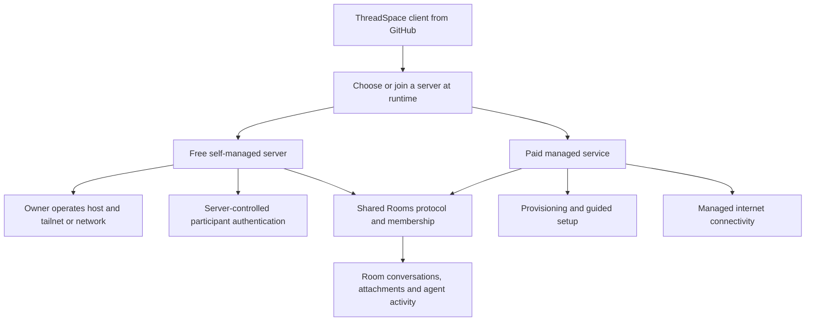
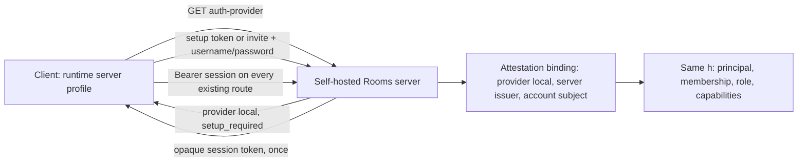
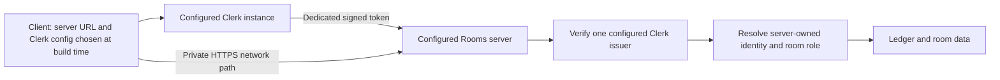

# ThreadSpace hosting and access

Product direction confirmed by Monroe on 2026-09-05: the GitHub release enables free,
self-managed rooms. The paid offering handles internet tunneling, provisioning, and setup.
Authentication is part of the free core; Clerk is not a product requirement.
The diagrams below distinguish inspected implementation from intended architecture.

## Intended product

One server can host multiple rooms. Room creation assigns membership inside that server;
host provisioning creates or configures the server itself. A friend can join with the same
released client without a custom build. Free refers to the ThreadSpace offering: the host
owner supplies their infrastructure and any independently required network/provider service.

The free authentication mechanism is now implemented as a local checkpoint on both sides
(2026-09-05, Rails `2ecba24`, client on `agent/rooms-self-service-creation`): server-owned
accounts with bcrypt passwords via Rails' `has_secure_password`, revocable device sessions
stored as digests, first-owner setup and password reset from operator-issued one-time
credentials, and invite enrollment that creates the account and the room membership in one
transaction. Clerk remains the adapter for managed deployments; one provider per server.
The development-only Local identity is not a production fallback. See
[the contract](https://github.com/benwilliams0540/t3rooms/tree/integrate/rooms-current/contracts/rooms/local-auth/v1)
and the "Implemented local sign-in" section below.

## Identity, hosting, and connectivity are separate

Monroe clarified on 2026-09-05 that someone should be able to use Google sign-in for
basic account information and then host rooms on their own local network for free.
Charging for managed internet connectivity and provisioning must not restrict local
hosting, joining, conversation history, attachments, or agent participation.

The recommended account design is optional Google sign-in alongside server-owned local
enrollment. Making Google mandatory would still require an external service for first
sign-in and account recovery. Offline-capable local enrollment is the recommended way
to preserve an independently useful LAN product; the exact mechanism remains to be selected.

- **Identity:** Google OpenID Connect can supply basic profile and email information with
  the `openid profile email` scopes. Use the verified issuer and subject as the external
  identity key, not email. Signing in does not automatically grant access to a room.
- **Free hosting:** Run the server on the owner's computer or another host; connect clients
  over a LAN, their own tailnet, or other supported private network. The server owns durable
  room data, invites, membership, and revocable sessions. No ThreadSpace cloud account or
  maintainer's Clerk workspace is required for local enrollment.
- **Paid convenience:** Provision servers, operate tunnels/relays and guided setup. The same
  room protocol remains usable with user-managed connectivity. Paid service expiration must
  not erase or disable locally hosted rooms; managed connectivity can stop.

Google sign-in requires an OAuth application registration and platform-specific client
configuration. For desktop, use the system browser and authorization code flow with PKCE;
it does not require Clerk. Clients must not forward a Google or another server's credentials
to arbitrary room URLs. Credential exchange and room-server trust need an explicit design.
Collecting a profile locally does not automatically send that email to the ThreadSpace company;
any hosted account registration is a separate, user-visible action.

Sources: [Google OpenID Connect](https://developers.google.com/identity/openid-connect/openid-connect),
[installed application OAuth](https://developers.google.com/identity/protocols/oauth2/native-app).

## Implemented local sign-in (checkpointed 2026-09-05)

Server (`ROOMS_HUMAN_AUTH_PROVIDER=local`, no Clerk variables):

- `bin/rails rooms:local:issue_setup` prints one setup credential; redeeming it creates the
  server issuer, the owner's account, principal, binding, and first session. Single use.
- Invites are unchanged. A new person enrolls with room ID + invite + username/password in
  one transaction; an invalid invite leaves no account behind.
- Sessions last 90 days, are revoked by sign-out, and all revoke on password reset
  (`USERNAME=<name> bin/rails rooms:local:issue_password_reset`). Identity and memberships
  survive a reset. Sign-in failures are one generic error; timing does not reveal usernames.
- A Clerk-configured server answers the local routes 404; a local server rejects JWT bearers.

Client:

- The Shared source has a runtime **server profile** (URL, provider, server ID, session)
  stored per device. Changing the URL discovers the provider first; a stored session is kept
  only if the server ID is unchanged, so repointing the URL never sends a session elsewhere.
- Exactly one source owns the published Rooms session. A local server owns it while selected;
  Clerk keeps its own intent and is republished when the profile is forgotten.
- The access panel offers sign in, join with invitation, set up server (when the server has no
  owner), and reset password. The dashboard shows the server and offers sign out.
- Transport: the five unauthenticated sign-in routes are admitted without a bearer; every
  other route still requires one. Desktop and browser transports send no Authorization header
  on those routes.

Decision to confirm: the local session token is persisted in the client's local storage per
server so reopening the app lands back in the room. It is revocable server-side and cleared
on sign-out. Electron encrypted storage would be a follow-up hardening, not a blocker.

Live proof completed 2026-09-06 against a running server (owner set-up, room, invite, friend
enrollment, second-device sign-in, live reply, server restart, sign-out rejection, wrong
password, stranger and bad-invite refusal): see `reports/app-local-sign-in-live-proof.md`.

Not yet done: native mobile enrollment/server selection UI, a packaged one-command server
install with persistent data and backups, plain-HTTP LAN origins (the client still requires
HTTPS or loopback; a tailnet with Tailscale Serve satisfies this), the Electron desktop
walk-through, and screenshot attachments in the channel composer.

## Inspected implementation today

Evidence:

- `apps/web/src/cloud/publicConfig.ts` reads the Rooms URL, Clerk publishable key, and JWT
  template from build variables. There is no general runtime server/auth profile here.
- In the Rails repository, `ledger/app/services/rooms/human_attestation/configuration.rb`
  accepts only `provider == "clerk"` and one configured issuer/audience/JWK endpoint.
- `ledger/app/services/rooms/human_access/identity_binding.rb` binds identity by provider,
  issuer, and subject. Changing issuers does not transfer existing memberships; matching
  display names or email must not silently merge identities.
- The private ingress runbook describes network access through Tailscale Serve while
  application requests still require human authentication. Tailnet access is not a room role.
- Local self-service creation commits: Rails `22575eb`, client `0c654c19c`. These create a
  logical room and #general on the selected existing server. They do not provision hosting,
  remove Clerk, or implement native mobile room creation. They are not deployed acceptance.

## Access scopes

| Scope                              | What it controls                                                      | What it does not grant                                           |
| ---------------------------------- | --------------------------------------------------------------------- | ---------------------------------------------------------------- |
| Room member/admin                  | Conversation, invitations, and room capabilities                      | Host shell, other rooms, Clerk dashboard, signing credentials    |
| Server operator                    | Deployment, database, network, and auth configuration                 | Automatic access to an unrelated Clerk workspace or Apple team   |
| Clerk workspace configuration role | Issuer instance settings, native origins/callbacks and permitted keys | A ThreadSpace room role or host shell                            |
| Apple developer team access        | Signing, provisioning and release services                            | Clerk configuration or room ownership                            |
| Local project sharing grant        | Selected project context available to room participants/agents        | Arbitrary machine access or permission to overwrite others' work |

## Current sign-in blocker

The renamed desktop app uses `threadspace://app`. The earlier diagnostic against the
configured Clerk instance returned `origin_authorization_headers_conflict` for that origin,
while the old `t3code://app` origin was accepted. This is provider configuration, not a need
for each user to become a room operator.

An authorized maintainer can preserve existing entries and add:

- `threadspace://app` to the instance's allowed origins through Clerk's Backend API.
- `threadspace://app/` to its native OAuth redirect allowlist.

Monroe needs his own configuration-capable membership in the current Clerk workspace to
perform this independently. An existing authorized workspace administrator must grant access;
ordinary application sign-in cannot grant it. No such access was established in this session.
Do not share Ben's login or put a Clerk secret in the client. A separate Clerk application is
possible, but changing the client and server issuer would create a separate identity setup,
not repair the existing instance or transfer its room memberships.

Clerk's current documentation lists Owner and Viewer on Hobby/Pro, with Admin and Developer
available on Business. Viewer cannot change configuration; Developer configuration access is
development-only. The current workspace plan and actual available roles have not been inspected.
Use the available role that covers the required environment; Owner carries broader authority.
Sources: [team access](https://clerk.com/docs/guides/dashboard/manage-team-access),
[workspace invitations](https://clerk.com/docs/guides/dashboard/overview),
[allowed origins](https://clerk.com/docs/reference/backend/instance/update).

Changing these Clerk entries does not require changing the Apple signing certificate.
Passkey provisioning and TestFlight remain separate work.

## Work order and acceptance

1. Done as a local checkpoint: runtime server profiles and explicit join/enrollment, with the
   session isolated per server ID. Advertised server auth configuration never sends an existing
   server's credentials to another server. Remaining: mobile UI and encrypted desktop storage.
2. Done as a local checkpoint: server-owned local authentication alongside Clerk, retaining the
   server-owned membership and capability model (Rails `has_secure_password`, digest-stored
   revocable sessions). Remaining: a live two-device proof against a running server.
3. Package a reproducible server install with persistent data, first-owner setup, network
   instructions, upgrades, backup and restore. The operator performs this once; friends only join.
4. Prove an unrelated person can install the released artifacts, host a room outside our
   network, invite another client, reopen history, and reject an unauthorized participant
   without any maintainer account, copied session, paid ThreadSpace service, or custom client build.

Repairing the existing Clerk instance can unblock the current private development build,
but is an optional parallel task rather than a prerequisite for this work order. Evaluate
Google account linking after the local host/join flow is independently usable.

Paid provisioning wraps this same usable room system. Cross-server room migration, universal
accounts, and federation are not established capabilities and need separate decisions if required.

Tracking: [room creation #17](https://github.com/benwilliams0540/t3code/issues/17),
[current sign-in #20](https://github.com/benwilliams0540/t3code/issues/20),
[free self-hosted release #27](https://github.com/benwilliams0540/t3code/issues/27).
