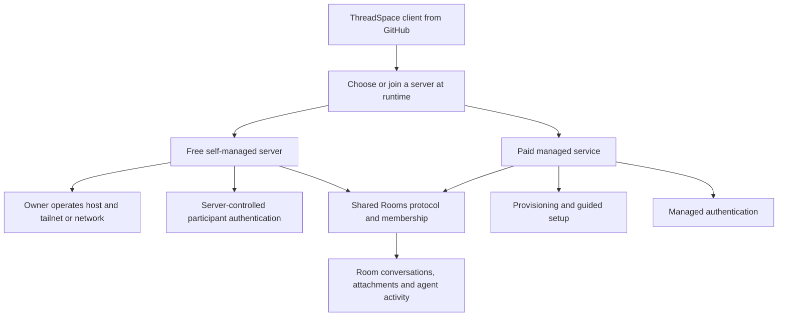
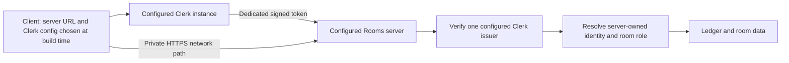

# ThreadSpace hosting and access

Product direction confirmed by Monroe on 2026-09-05: the GitHub release enables free,
self-managed rooms. The paid offering handles authentication, provisioning, and setup.
The diagrams below distinguish inspected implementation from intended architecture.

## Intended product

One server can host multiple rooms. Room creation assigns membership inside that server;
host provisioning creates or configures the server itself. A friend can join with the same
released client without a custom build. Free refers to the ThreadSpace offering: the host
owner supplies their infrastructure and any independently required network/provider service.

The free authentication mechanism is not implemented or selected yet. The recommended
first design to evaluate is server-owned enrollment and revocable device sessions, using
an established authentication implementation. Existing Clerk support can remain an adapter
for managed deployments. The development-only Local identity is not a production fallback.

## Inspected implementation today

Evidence:

- `apps/web/src/cloud/publicConfig.ts` reads the Rooms URL, Clerk publishable key, and JWT
  template from build variables. There is no general runtime server/auth profile here.
- In the Rails repository, `ledger/app/services/rooms/human_attestation/configuration.rb`
  accepts only `provider == "clerk"` and one configured issuer/audience/JWK endpoint.
- `ledger/app/services/rooms/human_access/identity_binding.rb` binds identity by provider,
  issuer, and subject. Changing issuers does not transfer existing memberships; matching
  display names or email must not silently merge identities.
- The private ingress runbook describes network access through Tailscale Serve while
  application requests still require human authentication. Tailnet access is not a room role.
- Local self-service creation commits: Rails `22575eb`, client `0c654c19c`. These create a
  logical room and #general on the selected existing server. They do not provision hosting,
  remove Clerk, or implement native mobile room creation. They are not deployed acceptance.

## Access scopes

| Scope                              | What it controls                                                      | What it does not grant                                           |
| ---------------------------------- | --------------------------------------------------------------------- | ---------------------------------------------------------------- |
| Room member/admin                  | Conversation, invitations, and room capabilities                      | Host shell, other rooms, Clerk dashboard, signing credentials    |
| Server operator                    | Deployment, database, network, and auth configuration                 | Automatic access to an unrelated Clerk workspace or Apple team   |
| Clerk workspace configuration role | Issuer instance settings, native origins/callbacks and permitted keys | A ThreadSpace room role or host shell                            |
| Apple developer team access        | Signing, provisioning and release services                            | Clerk configuration or room ownership                            |
| Local project sharing grant        | Selected project context available to room participants/agents        | Arbitrary machine access or permission to overwrite others' work |

## Current sign-in blocker

The renamed desktop app uses `threadspace://app`. The earlier diagnostic against the
configured Clerk instance returned `origin_authorization_headers_conflict` for that origin,
while the old `t3code://app` origin was accepted. This is provider configuration, not a need
for each user to become a room operator.

An authorized maintainer can preserve existing entries and add:

- `threadspace://app` to the instance's allowed origins through Clerk's Backend API.
- `threadspace://app/` to its native OAuth redirect allowlist.

Monroe needs his own configuration-capable membership in the current Clerk workspace to
perform this independently. An existing authorized workspace administrator must grant access;
ordinary application sign-in cannot grant it. No such access was established in this session.
Do not share Ben's login or put a Clerk secret in the client. A separate Clerk application is
possible, but changing the client and server issuer would create a separate identity setup,
not repair the existing instance or transfer its room memberships.

Clerk's current documentation lists Owner and Viewer on Hobby/Pro, with Admin and Developer
available on Business. Viewer cannot change configuration; Developer configuration access is
development-only. The current workspace plan and actual available roles have not been inspected.
Use the available role that covers the required environment; Owner carries broader authority.
Sources: [team access](https://clerk.com/docs/guides/dashboard/manage-team-access),
[workspace invitations](https://clerk.com/docs/guides/dashboard/overview),
[allowed origins](https://clerk.com/docs/reference/backend/instance/update).

Changing these Clerk entries does not require changing the Apple signing certificate.
Passkey provisioning and TestFlight remain separate work.

## Work order and acceptance

1. Repair team access to the existing Clerk instance and its ThreadSpace origin registration.
   This unlocks the current private development build without claiming self-hosting support.
2. Implement runtime server profiles and explicit join/enrollment, with credentials and cached
   data isolated per server/account. Advertised server auth configuration must not silently
   override user trust or send an existing server's credentials to another server.
3. Add and test a production self-hosted authentication path alongside Clerk, retaining the
   server-owned membership and capability model. Evaluate established implementations before
   selecting the mechanism; do not weaken authentication to meet the free-hosting requirement.
4. Package a reproducible server install with persistent data, first-owner setup, network
   instructions, upgrades, backup and restore. The operator performs this once; friends only join.
5. Prove an unrelated person can install the released artifacts, host a room outside our
   network, invite another client, reopen history, and reject an unauthorized participant
   without any maintainer account, copied session, paid ThreadSpace service, or custom client build.

Paid provisioning wraps this same usable room system. Cross-server room migration, universal
accounts, and federation are not established capabilities and need separate decisions if required.

Tracking: [room creation #17](https://github.com/benwilliams0540/t3code/issues/17),
[current sign-in #20](https://github.com/benwilliams0540/t3code/issues/20),
[free self-hosted release #27](https://github.com/benwilliams0540/t3code/issues/27).
